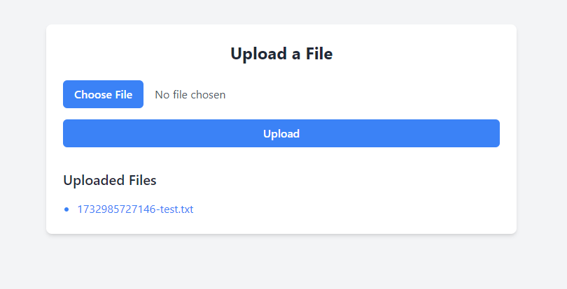

# File Upload Demo with TailwindCSS and Multer

This is a simple web application that demonstrates file upload functionality using **Node.js**, **Express**, **Multer**, and **TailwindCSS** for styling. The application allows users to upload files, displays a list of uploaded files, and serves them from the server.

## Features

- **Responsive Design**: Styled using TailwindCSS for a modern and user-friendly interface.
- **File Upload**: Uses Multer middleware to handle file uploads on the server.
- **Dynamic File List**: Displays a list of uploaded files with download links.
- **Stylized "Choose File" Button**: Replaces the default file input with a custom-styled button.
- **File Storage**: Files are stored locally in the `uploads/` directory.

---

## How It Works

1. The user selects a file using a custom-styled "Choose File" button.
2. The selected file is displayed next to the button.
3. Clicking the "Upload" button sends the file to the server.
4. The server processes the file using Multer and saves it to the `uploads/` directory.
5. The uploaded files are listed on the page with links for download.

---

## Technologies Used

- **Frontend**: 
  - HTML
  - TailwindCSS (via CDN)

- **Backend**:
  - Node.js
  - Express.js
  - Multer (for file uploads)

---

## Setup Instructions

### Prerequisites

- [Node.js](https://nodejs.org) installed on your system.
- A basic understanding of HTML, CSS, and JavaScript.

### Installation

1. Clone this repository:
   ```bash
   git clone https://github.com/your-username/file-upload-demo.git
   cd file-upload-demo
   ```

2. Install dependencies:
   ```bash
   npm install
   ```

3. Start the server:
   ```bash
   node server.js
   ```

4. Open your browser and visit:
   ```
   http://localhost:3000
   ```

---

## Project Structure

```
project/
│
├── public/               # Frontend files (HTML, CSS, JS)
│   └── index.html
├── uploads/              # Directory for uploaded files (auto-created)
├── server.js             # Backend application
├── package.json          # Dependencies and scripts
└── README.md             # Project documentation
```

---

## Customization

### TailwindCSS Styling

- The file input and buttons are styled using TailwindCSS utility classes. 
- To customize the design, modify the `class` attributes in `index.html`.

### File Storage

- Uploaded files are stored in the `uploads/` directory.
- To change the storage directory, update the `destination` field in the `Multer` configuration in `server.js`.

---

## Known Issues

- This demo does not include authentication or file validation. It is intended for learning purposes only.
- Files are stored locally and not on a cloud service.

---

## Screenshots

### Upload Page


---

## License

This project is licensed under the MIT License. Feel free to use it as a starting point for your own projects!
